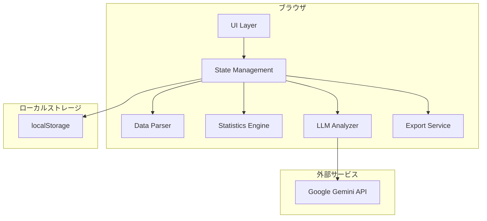
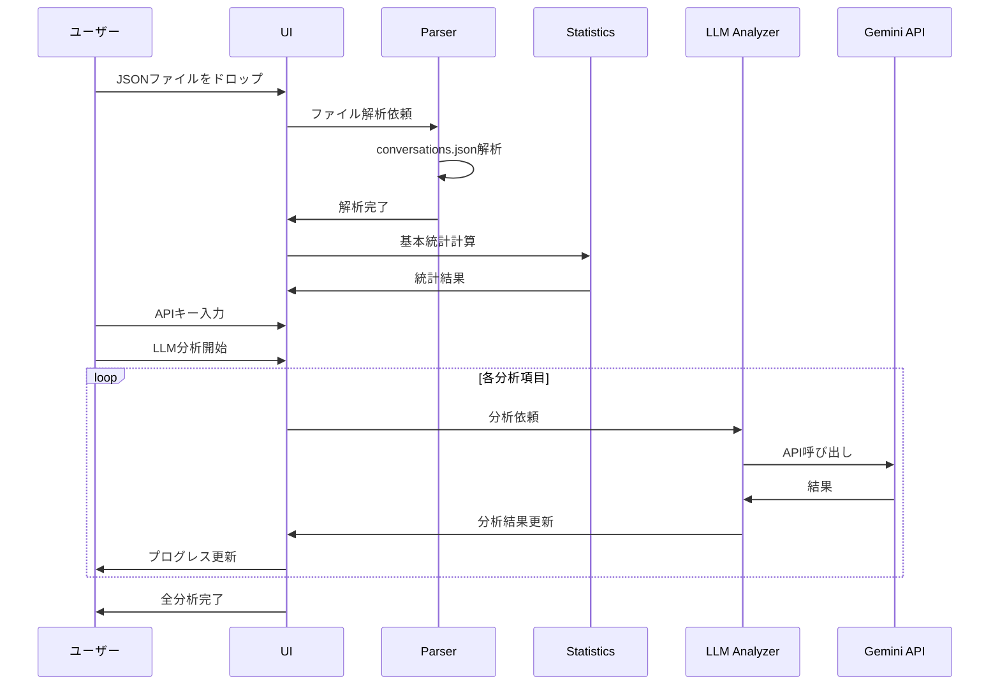
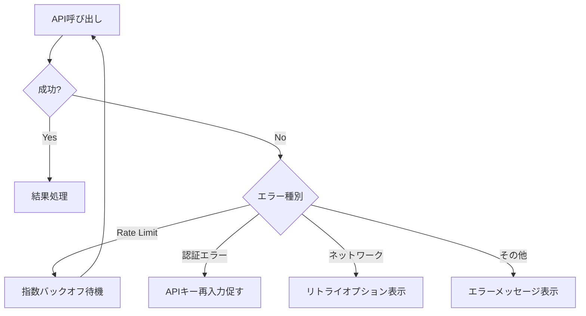
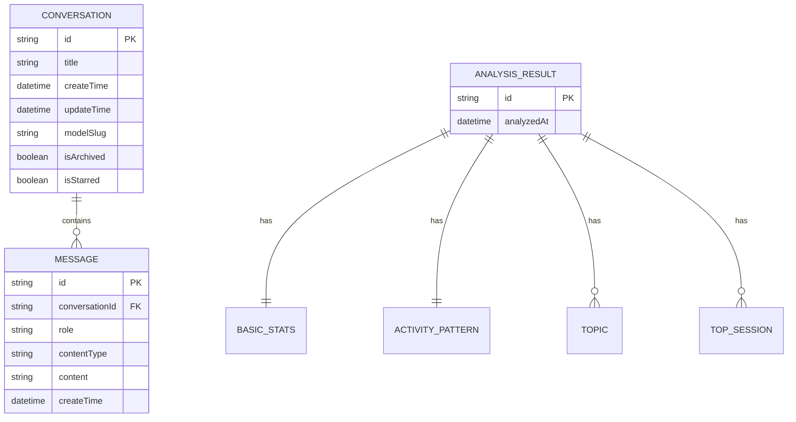

# Design Document

## Overview

**Purpose**: ChatGPT Wrappedは、ChatGPTの会話履歴エクスポートデータを分析し、Spotify Wrapped風の"エモい振り返り体験"を提供するブラウザベースのダッシュボードである。

**Users**: ChatGPTユーザーが1年間の利用パターン、トピック傾向、コミュニケーションスタイルを視覚的に振り返るために使用する。

**Impact**: ユーザーは自分のAI活用履歴を楽しく分析でき、SNS共有可能なサマリーを生成できる。

### Goals
- conversations.jsonからの完全なデータ解析
- Google Gemini APIを活用した高精度なLLM分析
- Spotify Wrapped風のエモいビジュアル体験
- ローカル完結（サーバーレス）での動作

### Non-Goals
- リアルタイム会話追跡（エクスポートファイルのみ対応）
- 複数ユーザー間の比較機能
- バックエンドサーバーの構築
- 有料プランやサブスクリプション機能

## Architecture

### Architecture Pattern & Boundary Map



**Architecture Integration**:
- **Selected pattern**: Component-Based SPA with React Context
- **Domain boundaries**: UI / Data Processing / API Integration / Export の4レイヤー
- **Existing patterns preserved**: なし（新規プロジェクト）
- **New components rationale**: 各レイヤーを独立させ、テスト容易性と再利用性を確保
- **Steering compliance**: ローカル完結、サーバーレス原則を遵守

### Technology Stack

| Layer | Choice / Version | Role in Feature | Notes |
|-------|------------------|-----------------|-------|
| Frontend | React 18 + TypeScript | UIコンポーネント、状態管理 | Viteでビルド |
| Styling | Tailwind CSS 3 | ダークモードUI、レスポンシブ | JIT mode |
| Charts | Recharts + D3.js | グラフ描画、2Dプロット | ヒートマップはカスタム |
| Dimensionality Reduction | DRUIDJS | Embeddings→2D変換 | PCA/t-SNE/UMAP対応 |
| Export | html2pdf.js | PNG/PDF出力 | html2canvas + jsPDF |
| API Client | @google/generative-ai | Gemini API呼び出し | 公式SDK |
| Storage | localStorage | APIキー、設定保存 | 暗号化オプション |

## System Flows

### メインフロー: データ分析プロセス



### エラーハンドリングフロー



## Requirements Traceability

| Requirement | Summary | Components | Interfaces | Flows |
|-------------|---------|------------|------------|-------|
| 1.1, 1.2 | ファイルアップロード | FileUploader, DataParser | FileUploaderProps, ParsedData | メインフロー |
| 1.3, 1.4 | バリデーション | DataParser | ValidationResult | メインフロー |
| 2.1-2.4 | APIキー管理 | ApiKeyManager | ApiKeyManagerProps | - |
| 3.1-3.5 | 基本統計 | StatisticsEngine, StatsCard | BasicStats | メインフロー |
| 4.1-4.3 | 活動パターン | ActivityHeatmap, MonthlyChart | ActivityPattern | メインフロー |
| 5.1-5.3 | 単語分析 | LLMAnalyzer, WordCloud | WordAnalysis | メインフロー |
| 6.1-6.3 | トピック分類 | LLMAnalyzer, TopicChart | TopicClassification | メインフロー |
| 7.1-7.3 | テーマ変遷 | LLMAnalyzer, TimelineChart | ThemeEvolution | メインフロー |
| 8.1-8.3 | 知性マップ | EmbeddingsAnalyzer, ScatterPlot | IntelligenceMap | メインフロー |
| 9.1-9.3 | 代表セッション | LLMAnalyzer, SessionCard | TopSessions | メインフロー |
| 10.1-10.3 | 文章特徴 | LLMAnalyzer, StyleCard | WritingStyle | メインフロー |
| 11.1-11.3 | スタイル診断 | LLMAnalyzer, DiagnosisCard | StyleDiagnosis | メインフロー |
| 12.1-12.3 | 名言選出 | LLMAnalyzer, QuoteCard | BestQuotes | メインフロー |
| 13.1-13.4 | UI/UXデザイン | 全UIコンポーネント | - | - |
| 14.1-14.3 | 進行状況 | ProgressBar, AnalysisStatus | AnalysisProgress | メインフロー |
| 15.1-15.3 | 保存・共有 | ExportService | ExportOptions | - |

## Components and Interfaces

| Component | Domain/Layer | Intent | Req Coverage | Key Dependencies | Contracts |
|-----------|--------------|--------|--------------|------------------|-----------|
| FileUploader | UI | ファイルD&D/選択 | 1.1, 1.2 | DataParser (P0) | Props |
| DataParser | Data Processing | JSON解析 | 1.1-1.4 | - | Service |
| ApiKeyManager | UI | APIキー入力/保存 | 2.1-2.4 | localStorage (P1) | Props, State |
| StatisticsEngine | Data Processing | 基本統計計算 | 3.1-3.5, 4.1-4.3 | ParsedData (P0) | Service |
| LLMAnalyzer | API Integration | OpenAI API呼び出し | 5-12 | OpenAI API (P0) | Service |
| EmbeddingsAnalyzer | API Integration | Embeddings取得+PCA | 8.1-8.3 | OpenAI API (P0), DRUIDJS (P0) | Service |
| ExportService | Export | PNG/PDF生成 | 15.1-15.3 | html2pdf.js (P0) | Service |
| ResultCards | UI | 結果表示カード群 | 3-12 | State (P0) | Props |
| ProgressBar | UI | 進行状況表示 | 14.1-14.3 | State (P0) | Props |

### Data Processing Layer

#### DataParser

| Field | Detail |
|-------|--------|
| Intent | conversations.jsonを解析し、構造化データに変換する |
| Requirements | 1.1, 1.2, 1.3, 1.4 |

**Responsibilities & Constraints**
- conversations.jsonのtree構造をフラット化
- メッセージの時系列順序を復元
- 不正フォーマットの検出とエラーハンドリング

**Dependencies**
- Inbound: FileUploader — ファイルデータ受信 (P0)
- Outbound: StatisticsEngine, LLMAnalyzer — 解析済みデータ提供 (P0)

**Contracts**: Service [x]

##### Service Interface
```typescript
// パース後の正規化された会話データ
interface Conversation {
  id: string;
  title: string;
  createTime: Date;
  updateTime: Date;
  modelSlug: string | null;
  isArchived: boolean;
  isStarred: boolean;
  gizmoId: string | null;      // カスタムGPT ID
  messages: Message[];
}

interface Message {
  id: string;
  role: 'user' | 'assistant' | 'system' | 'tool';
  contentType: 'text' | 'multimodal_text' | 'code';
  content: string;             // parts を結合したテキスト
  createTime: Date | null;
  metadata: {
    modelSlug?: string;
    isComplete?: boolean;
  };
}

interface ParseResult {
  success: boolean;
  data?: Conversation[];
  error?: ParseError;
  stats?: {
    totalConversations: number;
    totalMessages: number;
    skippedMessages: number;   // multimodal等でスキップした数
  };
}

interface ParseError {
  code: 'INVALID_JSON' | 'INVALID_FORMAT' | 'EMPTY_FILE' | 'UNSUPPORTED_VERSION';
  message: string;
  details?: string;
}

interface DataParserService {
  parse(file: File): Promise<ParseResult>;
  validate(json: unknown): ParseResult;
  // tree構造をフラット化してメッセージ配列に変換
  flattenMapping(mapping: Record<string, MappingNode>): Message[];
}
```

- Preconditions: ファイルが読み取り可能
- Postconditions: 成功時は全会話が時系列順で返却
- Invariants: メッセージのparent/children関係が正しく解決される

#### StatisticsEngine

| Field | Detail |
|-------|--------|
| Intent | 解析済みデータから基本統計を算出する |
| Requirements | 3.1, 3.2, 3.3, 3.4, 3.5, 4.1, 4.2, 4.3 |

**Responsibilities & Constraints**
- トークン数の推定（文字数ベース）
- 日付/時間帯の集計
- 連続利用日数の計算

**Dependencies**
- Inbound: DataParser — 解析済みデータ (P0)
- Outbound: UI Components — 統計データ (P0)

**Contracts**: Service [x]

##### Service Interface
```typescript
interface BasicStats {
  totalConversations: number;
  totalMessages: number;
  estimatedTokens: number;
  activeDays: number;
  longestStreak: number;
  dateRange: { start: Date; end: Date };
}

interface ActivityPattern {
  hourlyHeatmap: number[][]; // 7x24 (曜日x時間)
  monthlyMessages: { month: string; count: number }[];
  weekdayDistribution: { day: string; count: number }[];
}

interface StatisticsEngineService {
  calculateBasicStats(conversations: Conversation[]): BasicStats;
  calculateActivityPattern(conversations: Conversation[]): ActivityPattern;
}
```

### API Integration Layer

#### LLMAnalyzer

| Field | Detail |
|-------|--------|
| Intent | Google Gemini APIを使用してテキスト分析を実行する |
| Requirements | 5.1-5.3, 6.1-6.3, 7.1-7.3, 9.1-9.3, 10.1-10.3, 11.1-11.3, 12.1-12.3 |

**Responsibilities & Constraints**
- プロンプトエンジニアリング
- レート制限の遵守（Free tier: 15 RPM、Paid tier: 2000 RPM）
- エラーハンドリングとリトライ
- JSON mode（responseSchema）による構造化出力

**Dependencies**
- Inbound: UI — 分析リクエスト (P0)
- Outbound: UI — 分析結果 (P0)
- External: Google Gemini API (gemini-2.0-flash) (P0)

**Contracts**: Service [x]

##### Service Interface
```typescript
interface AnalysisRequest {
  type: AnalysisType;
  conversations: Conversation[];
  apiKey: string;
}

type AnalysisType =
  | 'word_analysis'
  | 'topic_classification'
  | 'theme_evolution'
  | 'top_sessions'
  | 'writing_style'
  | 'style_diagnosis'
  | 'best_quotes';

interface WordAnalysis {
  topWords: { word: string; count: number; }[];
  phrases: string[];
  importantWords: { word: string; tfidf: number; }[];
}

interface TopicClassification {
  topics: {
    name: string;
    percentage: number;
    emoji: string;
    conversationIds: string[];
  }[];
}

interface ThemeEvolution {
  months: {
    month: string;
    mainTopics: string[];
    newTopics: string[];
  }[];
}

interface TopSession {
  conversationId: string;
  title: string;
  reason: string;
  score: number;
}

interface WritingStyle {
  characteristics: string[];
  emotionalTendency: string[];
  questionPatterns: string[];
}

interface StyleDiagnosis {
  type: string;
  compatibilityScore: number;
  description: string;
}

interface BestQuote {
  quote: string;
  context: string;
  reason: string;
}

interface LLMAnalyzerService {
  analyze<T>(request: AnalysisRequest): Promise<AnalysisResult<T>>;
  abort(): void;
}

interface AnalysisResult<T> {
  success: boolean;
  data?: T;
  error?: ApiError;
}

interface ApiError {
  code: 'RATE_LIMIT' | 'AUTH_ERROR' | 'NETWORK_ERROR' | 'UNKNOWN';
  message: string;
  retryAfter?: number;
}
```

#### EmbeddingsAnalyzer

| Field | Detail |
|-------|--------|
| Intent | Gemini Embeddingsを取得し、PCAで2次元に削減して知性マップを生成する |
| Requirements | 8.1, 8.2, 8.3 |

**Responsibilities & Constraints**
- 会話のサマリー生成（Embeddings入力用）
- バッチ処理によるAPI呼び出し最適化
- DRUIDJS によるPCA実行
- 出力次元: 768（デフォルト3072から削減可能）

**Dependencies**
- Inbound: UI — 分析リクエスト (P0)
- Outbound: UI — 2Dプロットデータ (P0)
- External: Google Gemini Embeddings API (gemini-embedding-001) (P0), DRUIDJS (P0)

**Contracts**: Service [x]

##### Service Interface
```typescript
interface IntelligenceMap {
  points: {
    x: number;
    y: number;
    conversationId: string;
    title: string;
    summary: string;
  }[];
  axisLabels: {
    xPositive: string;
    xNegative: string;
    yPositive: string;
    yNegative: string;
  };
}

interface EmbeddingsAnalyzerService {
  generateMap(
    conversations: Conversation[],
    apiKey: string
  ): Promise<AnalysisResult<IntelligenceMap>>;
}
```

### Export Layer

#### ExportService

| Field | Detail |
|-------|--------|
| Intent | 分析結果をPNG/PDFとしてエクスポートする |
| Requirements | 15.1, 15.2, 15.3 |

**Responsibilities & Constraints**
- html2pdf.jsを使用したDOM→PDF変換
- canvas.toDataURL()でPNG生成
- SNS共有用サマリー画像生成

**Dependencies**
- Inbound: UI — エクスポートリクエスト (P0)
- External: html2pdf.js (P0)

**Contracts**: Service [x]

##### Service Interface
```typescript
interface ExportOptions {
  format: 'png' | 'pdf';
  target: 'card' | 'all' | 'summary';
  cardId?: string;
}

interface ExportResult {
  success: boolean;
  blob?: Blob;
  error?: string;
}

interface ExportServiceInterface {
  export(element: HTMLElement, options: ExportOptions): Promise<ExportResult>;
  generateSummaryImage(): Promise<Blob>;
}
```

### UI Layer

#### 共通Props定義

```typescript
interface BaseCardProps {
  title: string;
  isLoading: boolean;
  error?: string;
  onExport?: () => void;
}

interface AnalysisState {
  status: 'idle' | 'parsing' | 'analyzing' | 'complete' | 'error';
  progress: number;
  currentStep: string;
  results: AnalysisResults;
}

interface AnalysisResults {
  basicStats?: BasicStats;
  activityPattern?: ActivityPattern;
  wordAnalysis?: WordAnalysis;
  topicClassification?: TopicClassification;
  themeEvolution?: ThemeEvolution;
  intelligenceMap?: IntelligenceMap;
  topSessions?: TopSession[];
  writingStyle?: WritingStyle;
  styleDiagnosis?: StyleDiagnosis;
  bestQuotes?: BestQuote[];
}
```

#### FileUploader

| Field | Detail |
|-------|--------|
| Intent | ドラッグ&ドロップまたはファイル選択でJSONを受け付ける |
| Requirements | 1.1, 1.2 |

**Implementation Notes**
- react-dropzone使用を検討
- ファイルサイズ制限（100MB）
- ドラッグ中のビジュアルフィードバック

#### ProgressBar

| Field | Detail |
|-------|--------|
| Intent | LLM分析の進行状況を表示する |
| Requirements | 14.1, 14.2 |

**Implementation Notes**
- 7ステップ（7種類のLLM分析）の進捗表示
- 現在処理中の項目名を表示
- アニメーション付きプログレスバー

## Data Models

### Raw Input Format (conversations.json)

ChatGPTエクスポートファイルの実際の構造（実データより解析）:

```typescript
// conversations.json のルート構造
type ConversationsExport = RawConversation[];

// 各会話の構造
interface RawConversation {
  // 基本情報
  id: string;
  title: string;
  create_time: number;      // UNIXタイムスタンプ (秒)
  update_time: number;      // UNIXタイムスタンプ (秒)

  // メッセージツリー構造
  mapping: {
    [nodeId: string]: MappingNode;
  };
  current_node: string;     // 現在のノードID

  // メタデータ
  conversation_id: string;
  model_slug?: string;
  default_model_slug?: string;
  gizmo_id?: string;        // カスタムGPT使用時
  gizmo_type?: string;

  // フラグ
  is_archived: boolean;
  is_starred: boolean;
  is_read_only: boolean;
  is_do_not_remember: boolean;

  // その他
  moderation_results: unknown[];
  plugin_ids: string[] | null;
  safe_urls: string[];
  blocked_urls: string[];
  conversation_origin: string | null;
  voice: string | null;
  async_status: string | null;
}

// mapping内の各ノード
interface MappingNode {
  id: string;
  parent: string | null;      // 親ノードID（ルートはnull）
  children: string[];         // 子ノードIDの配列
  message: RawMessage | null; // ルートノードはnull
}

// メッセージの構造
interface RawMessage {
  id: string;
  author: {
    role: 'system' | 'user' | 'assistant' | 'tool';
    name: string | null;
    metadata: Record<string, unknown>;
  };
  create_time: number | null;  // UNIXタイムスタンプ
  update_time: number | null;
  content: {
    content_type: 'text' | 'multimodal_text' | 'code';
    parts: (string | object)[];  // テキストまたはマルチモーダルコンテンツ
  };
  status: string;              // 'finished_successfully' など
  end_turn: boolean;
  weight: number;
  metadata: {
    model_slug?: string;
    finish_details?: { type: string };
    is_complete?: boolean;
    citations?: unknown[];
    message_type?: string;
    [key: string]: unknown;
  };
  recipient: string;           // 'all' など
  channel: string | null;
}
```

**重要な発見事項**:
- 会話数: 70件（サンプルデータより）
- content_type: `text`, `multimodal_text`, `code` の3種類
- author.role: `user`, `assistant`, `system`, `tool` の4種類
- mapping は tree構造（parent/children で連結）
- `client-created-root` がルートノード名として使用される

### Domain Model (Internal)



### Logical Data Model

**Structure Definition**:
- Conversation: 1つのチャットセッション
- Message: 会話内の1メッセージ（user/assistant/system）
- AnalysisResult: 1回の分析結果を集約

**Consistency & Integrity**:
- メッセージはcreateTime順にソート
- 分析結果は揮発性（リロードで消失、永続化オプション検討）

### Data Contracts & Integration

**Google Gemini API Request/Response**:

```typescript
// @google/generative-ai SDK を使用

// Gemini Embeddings API
// 使用モデル: gemini-embedding-001
// エンドポイント: model.embedContent()
interface EmbeddingRequest {
  content: { parts: [{ text: string }] };
  taskType?: 'RETRIEVAL_DOCUMENT' | 'RETRIEVAL_QUERY' | 'SEMANTIC_SIMILARITY' | 'CLASSIFICATION' | 'CLUSTERING';
  outputDimensionality?: number;  // 768, 1536, 3072
}

interface EmbeddingResponse {
  embedding: {
    values: number[];  // 768〜3072次元
  };
}

// Gemini generateContent API
// 使用モデル: gemini-2.0-flash
interface GenerateContentRequest {
  contents: [{
    role: 'user';
    parts: [{ text: string }];
  }];
  generationConfig?: {
    responseMimeType?: 'application/json';
    responseSchema?: object;  // JSON Schema for structured output
    temperature?: number;
    maxOutputTokens?: number;
  };
}

interface GenerateContentResponse {
  candidates: [{
    content: {
      parts: [{ text: string }];
      role: 'model';
    };
    finishReason: string;
  }];
  usageMetadata: {
    promptTokenCount: number;
    candidatesTokenCount: number;
    totalTokenCount: number;
  };
}
```

## Error Handling

### Error Strategy

APIエラーは全てAnalysisResult型でラップし、UIで統一的にハンドリングする。

### Error Categories and Responses

**User Errors (4xx)**:
- 無効なAPIキー → APIキー再入力フォーム表示
- 無効なJSONファイル → フォーマットエラーメッセージ

**System Errors (5xx)**:
- Gemini API障害 → リトライボタン表示
- ネットワークエラー → オフライン検出、再接続待機

**Rate Limiting**:
- 429エラー → 指数バックオフで自動リトライ（最大3回）
- Retry-Afterヘッダー尊重

### Monitoring

- console.errorでエラーログ
- ユーザー向けトースト通知
- 分析ステップごとの失敗箇所特定

## Testing Strategy

### Unit Tests
- DataParser: 正常/異常JSONの解析テスト
- StatisticsEngine: 統計計算の正確性テスト
- LLMAnalyzer: モックAPIでのリクエスト/レスポンステスト

### Integration Tests
- ファイルアップロード→解析→統計表示フロー
- APIキー入力→LLM分析→結果表示フロー
- エクスポート機能テスト

### E2E Tests
- 完全な分析フロー（モックAPI使用）
- エラーハンドリングフロー
- レスポンシブデザイン確認

## Security Considerations

- **APIキー保護**: localStorageに保存時は暗号化オプション提供
- **データプライバシー**: 会話データはブラウザ内のみで処理、外部送信なし（OpenAI API除く）
- **入力バリデーション**: JSONパース前のサイズ/形式チェック
- **XSS対策**: ユーザー入力（会話内容）の適切なエスケープ

## Performance & Scalability

### Target Metrics
- JSON解析: 10MB以下は1秒以内
- LLM分析全体: 2分以内（API応答時間依存）
- 初回レンダリング: 1秒以内

### Optimization Techniques
- Web Workersで重い計算をオフロード
- 会話データのチャンク処理
- React.memoでの不要な再レンダリング防止
- 遅延ローディング（コード分割）
