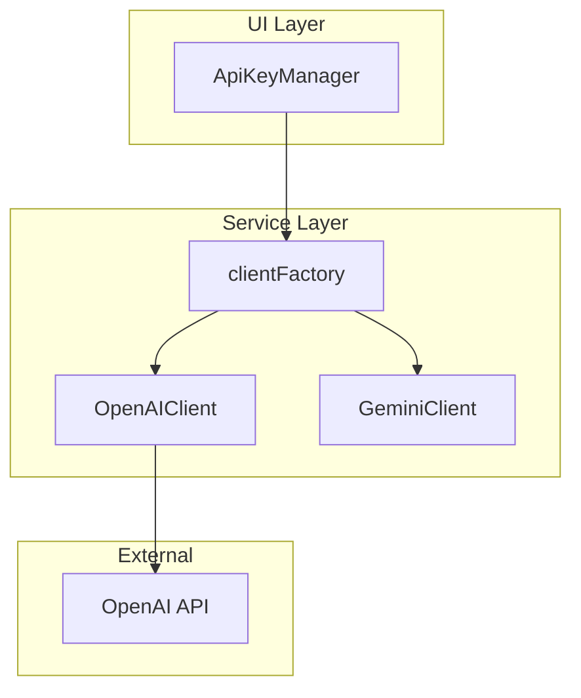

# Technical Design: OpenAI gpt-5-nano モデル対応の正式化

## Overview

**Purpose**: OpenAI gpt-5-nano モデルの正式サポートを確立し、ユーザーが使用モデルを把握できるUIと開発者向けドキュメントを提供する。

**Users**: ChatGPT Wrappedのエンドユーザーおよび開発者が、LLMプロバイダーとしてOpenAIを選択し、適切な設定で分析を実行できる。

**Impact**: 既存のOpenAIClient実装を維持しつつ、UI情報表示とドキュメントを追加する軽微な拡張。

### Goals
- ユーザーがOpenAI選択時に使用モデル（gpt-5-nano）を確認できる
- 開発者が環境変数でAPIキーを設定する方法を理解できる
- 既存の実装を正式なサポートとして文書化する

### Non-Goals
- モデル選択機能の追加（将来検討）
- OpenAI以外の新規LLMプロバイダー追加
- パフォーマンス最適化やリトライロジックの変更

## Architecture

### Existing Architecture Analysis

現在のシステムは以下のパターンを採用している：

- **Factory Pattern**: `clientFactory.ts`がLLMプロバイダーに応じて適切なクライアントを生成
- **Strategy Pattern**: `LLMClient`インターフェースによりGemini/OpenAIを抽象化
- **Context API**: `AnalysisContext`でアプリケーション状態を管理

本機能はこれらのパターンを維持し、UIコンポーネントへの情報追加のみを行う。

### Architecture Pattern & Boundary Map



**Architecture Integration**:
- Selected pattern: 既存のFactory Pattern + Strategy Patternを維持
- Domain/feature boundaries: UI層の情報表示追加のみ、Service層は変更なし
- Existing patterns preserved: LLMClient インターフェース、Barrel Exports
- New components rationale: 新規コンポーネントなし
- Steering compliance: レイヤードアーキテクチャ、単方向依存を維持

### Technology Stack

| Layer | Choice / Version | Role in Feature | Notes |
|-------|------------------|-----------------|-------|
| Frontend | React 19 | ApiKeyManagerでモデル情報表示 | 既存 |
| Service | openai ^6.10.0 | gpt-5-nano, text-embedding-3-small | 既存、変更なし |
| Storage | localStorage | プロバイダー選択の永続化 | 既存 |

## Requirements Traceability

| Requirement | Summary | Components | Status |
|-------------|---------|------------|--------|
| 1.1 | モデル名表示 | ApiKeyManager | **追加実装** |
| 1.2 | gpt-5-nano使用 | OpenAIClient | 実装済み |
| 1.3 | text-embedding-3-small使用 | OpenAIClient | 実装済み |
| 2.1 | APIキー検証 | ApiKeyManager | 実装済み |
| 2.2 | 401エラー表示 | ApiKeyManager | 実装済み |
| 2.3 | 403エラー表示 | ApiKeyManager | 実装済み |
| 2.4 | ローディング表示 | ApiKeyManager | 実装済み |
| 3.1-3.4 | リトライ（429/timeout/500/network） | OpenAIClient | 実装済み |
| 3.5 | 60秒タイムアウト | OpenAIClient | 実装済み |
| 4.1-4.3 | Structured Output | OpenAIClient | 実装済み |
| 5.1 | 環境変数読み込み | ApiKeyManager | 実装済み |
| 5.2 | localStorage優先 | ApiKeyManager | 実装済み |
| 5.3 | ドキュメント化 | README.md | **追加実装** |
| 6.1-6.4 | プロバイダー切り替え | ApiKeyManager, clientFactory | 実装済み |

## Components and Interfaces

| Component | Domain/Layer | Intent | Req Coverage | Status |
|-----------|--------------|--------|--------------|--------|
| ApiKeyManager | UI | APIキー管理とモデル情報表示 | 1.1, 2.1-2.4, 5.1-5.2, 6.1-6.3 | 拡張 |
| OpenAIClient | Service | OpenAI API通信 | 1.2-1.3, 3.1-3.5, 4.1-4.3 | 変更なし |
| clientFactory | Service | LLMクライアント生成 | 6.4 | 変更なし |
| README.md | Documentation | 環境変数設定ガイド | 5.3 | 追加 |

### UI Layer

#### ApiKeyManager

| Field | Detail |
|-------|--------|
| Intent | LLMプロバイダー選択、APIキー入力/検証/保存、モデル情報表示 |
| Requirements | 1.1, 2.1-2.4, 5.1-5.2, 6.1-6.3 |

**Responsibilities & Constraints**
- プロバイダー切り替えUI提供
- APIキー入力フォームと検証
- 検証済みキーのlocalStorage保存
- **新規**: OpenAI選択時のモデル名表示

**Dependencies**
- Outbound: OpenAI SDK — APIキー検証 (P0)
- Outbound: localStorage — 設定永続化 (P1)

**Contracts**: State [x]

##### State Management
```typescript
interface ApiKeyManagerState {
  provider: LLMProvider          // 'gemini' | 'openai'
  apiKey: string                 // 入力中のキー
  savedKeys: Record<LLMProvider, string | null>
  saveToStorage: boolean
  isValidating: boolean
  validationError: string | null
  isValid: boolean
}
```

**Implementation Notes**
- Integration: 既存の状態管理に変更なし。表示ロジックのみ追加
- Validation: OpenAIキー検証は `client.models.list()` を使用（実装済み）
- 追加実装: APIキー設定済み画面（L157-204）にモデル情報テキストを追加

##### UI変更仕様

**変更箇所**: APIキー設定済み表示（L184-202付近）

**追加表示内容**:
```
OpenAI APIキー設定済み
使用モデル: gpt-5-nano (Chat), text-embedding-3-small (Embedding)
```

**表示条件**: `provider === 'openai' && isValid && currentSavedKey`

### Documentation

#### README.md

| Field | Detail |
|-------|--------|
| Intent | 環境変数によるAPIキー設定方法の説明 |
| Requirements | 5.3 |

**追加セクション**:
```markdown
## 環境変数設定

開発時にUIを操作せずAPIキーを設定できます。

### 設定方法
1. プロジェクトルートに `.env` ファイルを作成
2. 以下の変数を設定:

```env
# Gemini API Key
VITE_GEMINI_API_KEY=your-gemini-api-key

# OpenAI API Key
VITE_OPENAI_API_KEY=your-openai-api-key
```

### 優先順位
localStorage > 環境変数

UIで設定したキーが優先されます。
```

## Error Handling

### Error Strategy
既存の実装を維持。OpenAIClient での包括的なエラーハンドリングが既に実装済み。

### Error Categories and Responses
| Error | HTTP Status | User Message | Recovery |
|-------|-------------|--------------|----------|
| 無効なAPIキー | 401 | 「無効なAPIキーです」 | 正しいキーを再入力 |
| 権限不足 | 403 | 「APIキーに必要な権限がありません」 | 権限付きキーを取得 |
| レート制限 | 429 | 自動リトライ（最大3回） | 指数バックオフ |
| サーバーエラー | 500/503 | 自動リトライ（最大3回） | 指数バックオフ |
| タイムアウト | - | 自動リトライ（最大3回） | 60秒タイムアウト |

## Testing Strategy

### Unit Tests
本機能は軽微なUI追加のため、既存テストで十分。追加テストは不要。

### Manual Verification
1. OpenAI選択時にモデル名が表示されることを確認
2. Gemini選択時にはOpenAIモデル情報が表示されないことを確認
3. README.mdの環境変数設定手順が正確であることを確認

## Security Considerations

既存のセキュリティ設計を維持：
- APIキーはクライアントサイドのみで使用（サーバー送信なし）
- パスワードフィールドでマスク表示
- localStorageへの保存はユーザー同意時のみ
