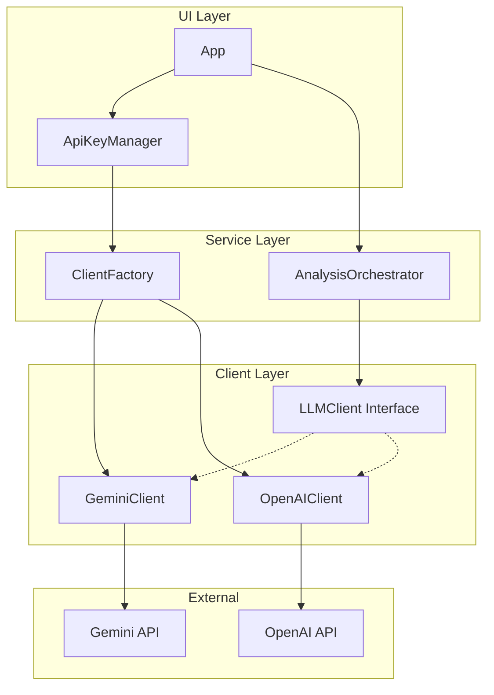
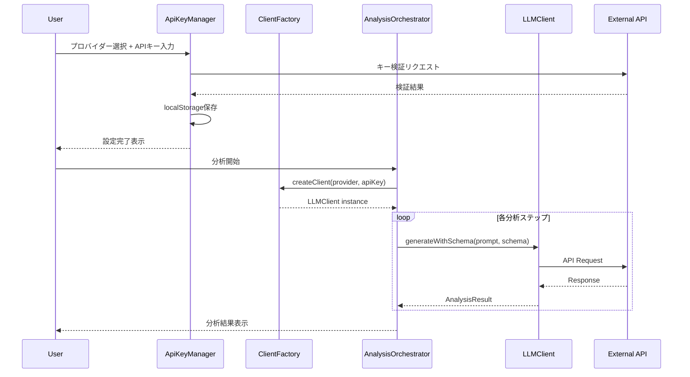

# Design Document: OpenAI API Support

## Overview

**Purpose**: ChatGPT WrappedアプリケーションにOpenAI API対応を追加し、ユーザーがGeminiまたはOpenAIを選択してLLM分析を実行できるようにする。

**Users**: ChatGPT Wrappedのエンドユーザー（OpenAI APIキーを所有）、開発者（環境変数でのキー設定）

**Impact**: 現在のGemini専用アーキテクチャを、プロバイダー抽象化レイヤーを導入してマルチプロバイダー対応に拡張する。

### Goals
- OpenAI API（gpt-5-nano）を使用した会話分析の実行
- Gemini/OpenAIの切り替えをUIから選択可能に
- 既存のGemini機能を維持したまま拡張

### Non-Goals
- 複数プロバイダーの同時使用
- プロバイダー間での結果比較機能
- Claude等の他LLMプロバイダー対応（将来検討）

## Architecture

### Existing Architecture Analysis

現行システムは`GeminiClient`クラスがAPIアクセスを直接担当し、`AnalysisOrchestrator`が`GeminiClient`を直接インスタンス化している。この結合を解消するため、クライアントインターフェースの抽象化を導入する。

**修正が必要なコンポーネント**:
- `src/services/geminiClient.ts` — インターフェース実装に変更
- `src/services/analysisOrchestrator.ts` — クライアント注入方式に変更
- `src/components/ApiKeyManager.tsx` — プロバイダー選択UI追加

### Architecture Pattern & Boundary Map



**Architecture Integration**:
- **Selected Pattern**: Strategy Pattern + Factory Pattern
- **Domain Boundaries**: UI（プロバイダー選択）、Service（分析オーケストレーション）、Client（API通信）
- **Existing Patterns Preserved**: React Context状態管理、Barrel Exports、エラーハンドリングパターン
- **Steering Compliance**: レイヤードアーキテクチャ維持、単方向依存

### Technology Stack

| Layer | Choice / Version | Role in Feature | Notes |
|-------|------------------|-----------------|-------|
| Frontend | React 19 | プロバイダー選択UI | 既存 |
| Services | TypeScript | LLMClient実装 | 既存 |
| External API | OpenAI API | gpt-5-nano, text-embedding-3-small | 新規 |
| Library | openai (npm) | OpenAI API SDK | 新規依存 |

## System Flows

### プロバイダー選択・分析実行フロー



## Requirements Traceability

| Requirement | Summary | Components | Interfaces | Flows |
|-------------|---------|------------|------------|-------|
| 1.1, 1.2, 1.3 | プロバイダー選択UI | ApiKeyManager | - | プロバイダー選択フロー |
| 2.1 | OpenAIClient実装 | OpenAIClient | LLMClient | - |
| 2.2, 2.3, 2.4, 2.5 | エラーハンドリング | OpenAIClient | LLMClient | - |
| 3.1, 3.2, 3.3, 3.4 | APIキー検証 | ApiKeyManager | - | キー検証フロー |
| 4.1, 4.2, 4.3 | オーケストレーター統合 | AnalysisOrchestrator, ClientFactory | LLMClient | 分析実行フロー |
| 5.1, 5.2, 5.3 | 環境変数対応 | ApiKeyManager | - | 初期化フロー |

## Components and Interfaces

| Component | Domain/Layer | Intent | Req Coverage | Key Dependencies | Contracts |
|-----------|--------------|--------|--------------|------------------|-----------|
| LLMClient | Service/Interface | LLMクライアント共通インターフェース | 2.1, 4.1-4.3 | - | Service |
| OpenAIClient | Service/Client | OpenAI API通信 | 2.1-2.5 | openai SDK (P0) | Service |
| GeminiClient | Service/Client | Gemini API通信（リファクタ） | 4.2 | @google/generative-ai (P0) | Service |
| ClientFactory | Service/Factory | プロバイダーに応じたクライアント生成 | 4.1, 4.2 | LLMClient (P0) | Service |
| ApiKeyManager | UI/Component | プロバイダー選択・キー管理UI | 1.1-1.3, 3.1-3.4, 5.1-5.3 | ClientFactory (P1) | State |

### Service Layer

#### LLMClient (Interface)

| Field | Detail |
|-------|--------|
| Intent | プロバイダー非依存のLLMクライアントインターフェース定義 |
| Requirements | 2.1, 4.1, 4.2, 4.3 |

**Responsibilities & Constraints**
- テキスト生成、スキーマ付き生成、Embedding取得の3メソッドを定義
- エラー型は既存の`ApiError`を使用
- プロバイダー固有の実装詳細を隠蔽

**Contracts**: Service [x]

##### Service Interface
```typescript
interface LLMClient {
  generateWithSchema<T>(prompt: string, schema: JSONSchema): Promise<AnalysisResult<T>>;
  generate(prompt: string): Promise<AnalysisResult<string>>;
  getEmbedding(text: string): Promise<AnalysisResult<number[]>>;
  abort(): void;
}

// JSON Schema型（OpenAI互換形式を共通形式として採用）
interface JSONSchema {
  type: 'object' | 'array' | 'string' | 'number' | 'boolean';
  properties?: Record<string, JSONSchema>;
  items?: JSONSchema;
  required?: string[];
  enum?: string[];
}
```
- Preconditions: apiKeyが有効であること
- Postconditions: AnalysisResult形式で成功/失敗を返却
- Invariants: abort()呼び出し後は進行中リクエストがキャンセルされる

#### OpenAIClient

| Field | Detail |
|-------|--------|
| Intent | OpenAI APIとの通信を担当 |
| Requirements | 2.1, 2.2, 2.3, 2.4, 2.5 |

**Responsibilities & Constraints**
- `gpt-5-nano` モデルを使用したテキスト生成
- `text-embedding-3-small` モデルを使用したEmbedding生成
- Structured Outputs対応（response_format: json_schema）
- 指数バックオフリトライ（最大3回）
- 60秒タイムアウト

**Dependencies**
- External: openai npm package — API通信 (P0)

**Contracts**: Service [x]

##### Service Interface
```typescript
class OpenAIClient implements LLMClient {
  constructor(apiKey: string);

  async generateWithSchema<T>(prompt: string, schema: JSONSchema): Promise<AnalysisResult<T>>;
  async generate(prompt: string): Promise<AnalysisResult<string>>;
  async getEmbedding(text: string): Promise<AnalysisResult<number[]>>;
  abort(): void;
}
```

**Implementation Notes**
- Integration: OpenAI SDK の `chat.completions.create` を使用
- Validation: APIエラーは `OpenAI.APIError` で捕捉、status codeでエラー種別判定
- Risks: Structured Outputsのスキーマ制約（required必須、additionalProperties: false）

#### ClientFactory

| Field | Detail |
|-------|--------|
| Intent | プロバイダー種別に応じた適切なLLMClientインスタンスを生成 |
| Requirements | 4.1, 4.2 |

**Responsibilities & Constraints**
- プロバイダー名とAPIキーからクライアントを生成
- 不明なプロバイダーはエラー

**Dependencies**
- Outbound: GeminiClient, OpenAIClient — クライアント生成 (P0)

**Contracts**: Service [x]

##### Service Interface
```typescript
type LLMProvider = 'gemini' | 'openai';

function createLLMClient(provider: LLMProvider, apiKey: string): LLMClient;
```
- Preconditions: provider は 'gemini' | 'openai' のいずれか
- Postconditions: 指定プロバイダーのLLMClientインスタンスを返却

### UI Layer

#### ApiKeyManager (Refactored)

| Field | Detail |
|-------|--------|
| Intent | プロバイダー選択とAPIキー管理のUI |
| Requirements | 1.1, 1.2, 1.3, 3.1, 3.2, 3.3, 3.4, 5.1, 5.2, 5.3 |

**Responsibilities & Constraints**
- Gemini/OpenAIの切り替えタブまたはセレクトボックスを提供
- 選択されたプロバイダーに応じた入力フィールド表示
- APIキー検証（プロバイダー別のテストリクエスト）
- localStorage永続化（プロバイダー + キー）
- 環境変数からの初期値読み込み

**Dependencies**
- External: OpenAI SDK — キー検証 (P1)
- External: Gemini SDK — キー検証 (P1)

**Contracts**: State [x]

##### State Management
```typescript
interface ApiKeyState {
  provider: LLMProvider;
  apiKey: string;
  isValid: boolean;
  isValidating: boolean;
  error: string | null;
}

// localStorage keys
const STORAGE_KEY_PROVIDER = 'chatgpt-wrapped-llm-provider';
const STORAGE_KEY_GEMINI = 'chatgpt-wrapped-gemini-api-key';
const STORAGE_KEY_OPENAI = 'chatgpt-wrapped-openai-api-key';

// 環境変数
const ENV_GEMINI_KEY = import.meta.env.VITE_GEMINI_API_KEY;
const ENV_OPENAI_KEY = import.meta.env.VITE_OPENAI_API_KEY;
```

**Implementation Notes**
- Integration: 親コンポーネントへは `onApiKeyChange(provider, apiKey)` コールバックで通知
- Validation: プロバイダー切り替え時は前回保存キーを復元
- Risks: 両プロバイダーのキーが環境変数にある場合のデフォルト選択（localStorage優先、なければGemini）

## Data Models

### Domain Model

**LLMProvider**: プロバイダー種別を表す値オブジェクト
```typescript
type LLMProvider = 'gemini' | 'openai';
```

**ApiKeyConfig**: プロバイダーとAPIキーのペア
```typescript
interface ApiKeyConfig {
  provider: LLMProvider;
  apiKey: string;
}
```

### Data Contracts & Integration

**API Data Transfer** — OpenAI Chat Completions Request
```typescript
interface OpenAIChatRequest {
  model: 'gpt-5-nano';
  messages: Array<{ role: 'user' | 'assistant' | 'system'; content: string }>;
  response_format?: {
    type: 'json_schema';
    json_schema: {
      name: string;
      schema: JSONSchema;
      strict: true;
    };
  };
}
```

**API Data Transfer** — OpenAI Embeddings Request
```typescript
interface OpenAIEmbeddingRequest {
  model: 'text-embedding-3-small';
  input: string;
}
```

## Error Handling

### Error Strategy

既存の`ApiError`型を維持し、プロバイダー間で統一されたエラーコードを使用する。

### Error Categories and Responses

| Error Code | OpenAI Status | Gemini Error | User Message |
|------------|---------------|--------------|--------------|
| RATE_LIMIT | 429 | 429/quota | APIレート制限に達しました |
| AUTH_ERROR | 401 | API_KEY_INVALID | APIキーが無効です |
| NETWORK_ERROR | fetch failed | fetch failed | ネットワークエラーが発生しました |
| TIMEOUT | - | - | リクエストがタイムアウトしました |
| SERVER_ERROR | 500/503 | 500/503 | サーバーエラーが発生しました |

### Monitoring

- 各APIリクエストのエラーはconsole.errorでログ出力（既存パターン維持）
- リトライ回数・バックオフ時間をログ

## Testing Strategy

### Unit Tests
- `OpenAIClient.generateWithSchema`: 正常系・エラー系・リトライ動作
- `OpenAIClient.getEmbedding`: 正常系・エラー系
- `ClientFactory.createLLMClient`: 各プロバイダーの正しいインスタンス生成
- JSON Schema変換ユーティリティ（Gemini SchemaType ↔ JSON Schema）

### Integration Tests
- `AnalysisOrchestrator` + `OpenAIClient`: 分析フロー全体の動作確認
- `ApiKeyManager`: プロバイダー切り替え・キー保存・復元

### E2E Tests
- プロバイダー選択 → キー入力 → 検証 → 分析実行の一連のフロー
- プロバイダー切り替え時のキー保持確認

## Security Considerations

- APIキーはlocalStorageに保存（既存パターン維持）
- APIキーはマスク表示（`***...xxxx`形式）
- 環境変数からのキー読み込みは開発用途想定
- APIキーをログ出力しない
